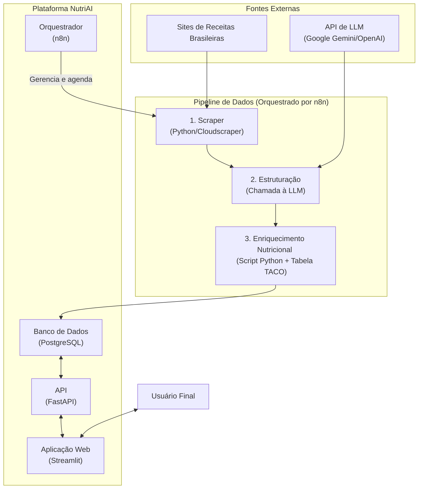

# NutriAI: Plataforma Inteligente de Nutrição e Receitas

[](https://github.com/Kamuratt/NutriIA)
[](https://www.docker.com/)

**NutriAI** é uma plataforma de engenharia de dados de ponta a ponta, projetada para transformar a maneira como as pessoas interagem com a culinária e a nutrição. O sistema automatiza a coleta, estruturação, enriquecimento e disponibilização de receitas brasileiras, criando um ativo de dados único e de alto valor para aplicações inteligentes.

---

## O Problema

No cenário digital atual, as ferramentas de receitas e nutrição são frequentemente genéricas e fragmentadas, resultando em uma experiência de usuário insatisfatória:

-   **Conteúdo Não-Localizado:** A maioria das bases de dados de receitas é internacional, ignorando a riqueza da cultura, dos ingredientes e dos sabores do Brasil.
-   **Análise Nutricional Manual:** Receitas online raramente incluem informações nutricionais precisas, forçando usuários com metas de saúde a realizar cálculos manuais tediosos e propensos a erros.
-   **Desperdício de Alimentos:** A dificuldade em encontrar receitas com base nos ingredientes já disponíveis em casa leva ao descarte de alimentos e ao desperdício de dinheiro.
-   **Busca Simplista:** As ferramentas de busca de receitas ainda são baseadas em palavras-chave, sem uma compreensão real do contexto, das preferências ou das restrições do usuário.

## A Solução Proposta

NutriAI aborda esses problemas através de um pipeline de dados automatizado e uma arquitetura de microsserviços desacoplada, entregando dados de alta qualidade via API para aplicações inteligentes.

1.  **Coleta Automatizada (Web Scraping):** Um scraper robusto em Python varre fontes populares de receitas brasileiras para construir um *data lake* de pratos autênticos e relevantes.
2.  **Estruturação Inteligente (LLM Parsing):** Modelos de Linguagem de Grande Porte (LLMs) processam o texto bruto de cada receita, extraindo ingredientes, quantidades, unidades e passos de preparo em um formato JSON padronizado e limpo.
3.  **Enriquecimento de Dados (Análise Nutricional):** Um script cruza os ingredientes extraídos com a **Tabela Brasileira de Composição de Alimentos (TACO)** para calcular, com alta precisão, o perfil nutricional completo de cada prato (calorias, macronutrientes, etc.).
4.  **Serviço e Visualização (API & Frontend):** Uma API RESTful expõe essa base de dados enriquecida, permitindo que aplicações, como o nosso dashboard interativo em Streamlit, façam consultas complexas e inteligentes.

---

## Arquitetura do Sistema

O projeto é orquestrado em uma arquitetura de microsserviços gerenciada via Docker Compose. Essa abordagem garante que cada componente seja independente, escalável e fácil de manter.



O fluxo de dados é totalmente automatizado: o **n8n** agenda e executa o **scraper**, que coleta os dados brutos. Em seguida, o mesmo workflow orquestra a chamada à **API da LLM** para estruturação e ao script de **enriquecimento nutricional**, persistindo o resultado final no banco de dados **PostgreSQL**. A **API FastAPI** serve esses dados para a aplicação **Streamlit**, onde o usuário pode interagir com as receitas.

---

## Stack Tecnológico

A seleção de tecnologias foi feita para garantir performance, escalabilidade e uma excelente experiência de desenvolvimento.

-   **Backend & API:** **FastAPI**
    -   *Por quê?* Pela sua alta performance assíncrona, validação de dados nativa com Pydantic e geração automática de documentação interativa (Swagger UI).
-   **Frontend:** **Streamlit**
    -   *Por quê?* Permite a prototipagem e construção rápida de aplicações de dados interativas com Python puro, ideal para visualização e interação com a API.
-   **Orquestração de Workflows:** **n8n**
    -   *Por quê?* Uma ferramenta *low-code* poderosa para automação de pipelines. Permite visualizar, agendar e gerenciar o fluxo de dados de forma intuitiva.
-   **Banco de Dados:** **PostgreSQL**
    -   *Por quê?* Um banco de dados relacional robusto, confiável e com excelente suporte para tipos de dados complexos como JSON, ideal para armazenar as receitas estruturadas.
-   **Inteligência Artificial:** **APIs do Google Gemini / OpenAI**
    -   *Por quê?* Modelos de ponta para tarefas de Processamento de Linguagem Natural, capazes de extrair informações de texto não-estruturado com alta precisão.
-   **Infraestrutura:** **Docker & Docker Compose**
    -   *Por quê?* Para criar um ambiente de desenvolvimento e produção consistente, reprodutível e isolado, simplificando o setup e o deploy.

---

## Estrutura do Projeto

O repositório está organizado da seguinte forma para manter a clareza e a separação de responsabilidades:

```
.
├── api/             # Lógica do backend e serviço da API com FastAPI
├── data/            # Arquivos de dados, como a Tabela TACO processada
├── n8n/             # Configurações e workflows do n8n
├── scripts/         # Scripts independentes (scraper, enriquecimento, etc.)
├── streamlit-app/   # Código da aplicação frontend com Streamlit
├── .env.example     # Template para variáveis de ambiente
├── docker-compose.yml # Orquestração de todos os serviços
└── README.md        # Esta documentação
```

---

## Guia de Instalação e Uso

O projeto é 100% conteinerizado. Siga os passos abaixo para executar a plataforma completa localmente.

1.  **Pré-requisitos:**
    * [Docker](https://www.docker.com/get-started) e [Docker Compose](https://docs.docker.com/compose/install/) instalados.
    * [Git](https://git-scm.com/) para clonar o repositório.

2.  **Clonagem do Repositório:**
    ```bash
    git clone [https://github.com/Kamuratt/NutriIA.git](https://github.com/Kamuratt/NutriIA.git)
    cd NutriIA
    ```

3.  **Configuração do Ambiente:**
    * Crie uma cópia do arquivo de exemplo `.env.example` e renomeie para `.env`.
    * Edite o arquivo `.env` e preencha as variáveis de ambiente, especialmente sua chave de API para a LLM (`GEMINI_API_KEY`).

4.  **Execução da Plataforma:**
    ```bash
    docker-compose up --build
    ```
    Este comando irá construir as imagens Docker (na primeira vez) e iniciar todos os contêineres de forma integrada.

5.  **Acesso aos Serviços:**
    * **Aplicação Web (Frontend):** `http://localhost:8501`
    * **Documentação da API (Swagger):** `http://localhost:8000/docs`
    * **Painel de Automação (n8n):** `http://localhost:5678`

---

## Roadmap de Desenvolvimento

Nosso plano de desenvolvimento está focado em transformar o protótipo funcional em um produto de dados robusto, confiável e com funcionalidades inteligentes.

### Fase 1: Fundação e MVP (Concluída ✅)
-   [x] Desenvolvimento do Scraper e pipeline de dados inicial.
-   [x] Integração com LLM para estruturação de receitas.
-   [x] Implementação da API base e do banco de dados.
-   [x] Conteinerização completa da aplicação com Docker.
-   [x] Automação do pipeline com workflows no n8n.
-   [x] Criação de um frontend interativo com Streamlit.

### Fase 2: Robustez e Qualidade de Dados (Foco Atual 🎯)
O objetivo desta fase é tornar o pipeline à prova de falhas e garantir a máxima qualidade e consistência dos dados.
-   [ ] **Validação de Dados:** Implementar `Pydantic` de forma estrita na API para garantir a integridade dos dados que entram e saem do sistema.
-   [ ] **Logging Estruturado:** Substituir `print()` por um sistema de logging robusto (ex: módulo `logging` do Python) para monitorar e depurar os serviços de forma eficaz.
-   [ ] **Normalização de Ingredientes:** Criar um módulo para padronizar nomes de ingredientes (ex: "tomate cereja" -> "tomate") antes da análise nutricional para aumentar a precisão.

### Fase 3: Otimização e Escalabilidade (Próximos Passos 🚀)
-   [ ] **Implementar Cache:** Evitar reprocessamento de receitas já analisadas para economizar custos de API e tempo de processamento.
-   [ ] **Desenvolver Scraping Incremental:** Refinar o scraper para buscar apenas por conteúdo novo ou atualizado, tornando a coleta mais eficiente.
-   [ ] **Adicionar Testes Automatizados:** Implementar testes unitários e de integração com `pytest` para garantir a estabilidade do código.

### Fase 4: Expansão da Inteligência (Features Futuras 💡)
-   [ ] **Módulo "Desperdício Zero":** Funcionalidade para o usuário inserir os ingredientes que possui e receber um plano de refeições otimizado.
-   [ ] **Módulo "Paladar Personalizado":** Sistema de recomendação que aprende as preferências do usuário para sugerir novas receitas.
-   [ ] **CI/CD:** Configurar um pipeline de Integração e Deploy Contínuos com GitHub Actions para automatizar os testes e o deploy.
