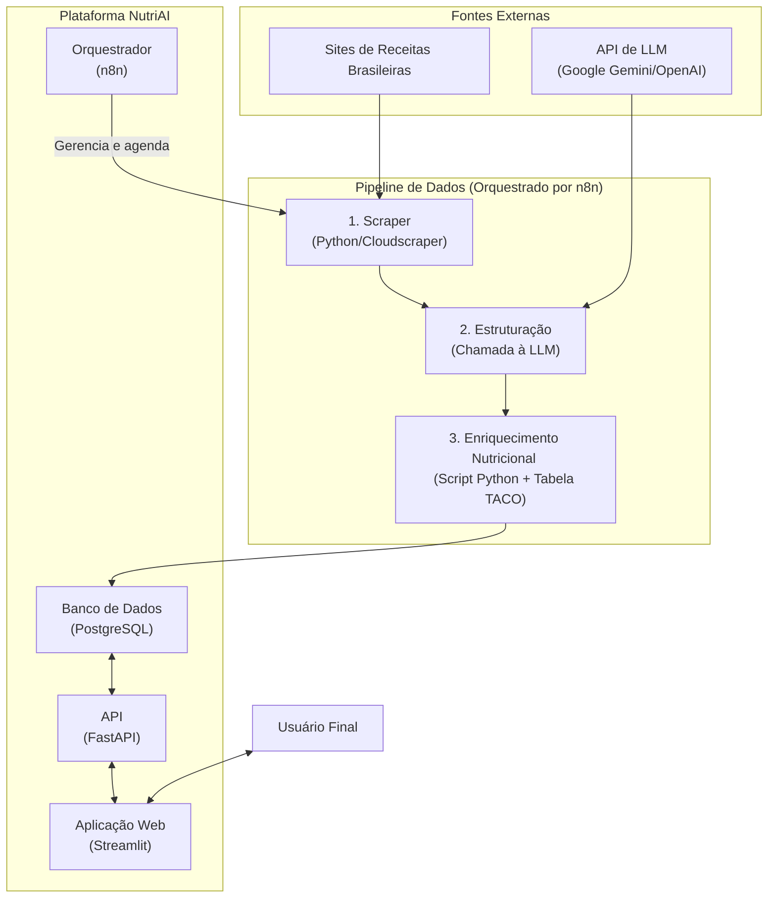

# NutriAI: Plataforma Inteligente de Nutrição e Receitas

[](https://github.com/Kamuratt/NutriIA)
[](https://www.docker.com/)

**NutriAI** é uma plataforma de engenharia de dados de ponta a ponta, projetada para transformar a maneira como as pessoas interagem com a culinária e a nutrição. O sistema automatiza a coleta, estruturação, enriquecimento e disponibilização de receitas brasileiras, culminando em um planejador de dietas inteligente que entrega planos nutricionais personalizados em PDF.

---

## O Problema

No cenário digital atual, as ferramentas de receitas e nutrição são frequentemente genéricas e fragmentadas, resultando em uma experiência de usuário insatisfatória:

-   **Conteúdo Não-Localizado:** A maioria das bases de dados de receitas é internacional, ignorando a riqueza da cultura, dos ingredientes e dos sabores do Brasil.
-   **Análise Nutricional Manual:** Receitas online raramente incluem informações nutricionais precisas, forçando usuários com metas de saúde a realizar cálculos manuais tediosos e propensos a erros.
-   **Desperdício de Alimentos:** A dificuldade em encontrar receitas com base nos ingredientes já disponíveis em casa leva ao descarte de alimentos e ao desperdício de dinheiro.
-   **Planejamento Genérico:** Ferramentas de dieta muitas vezes fornecem metas calóricas, mas deixam o usuário sozinho na tarefa complexa de criar um plano de refeições variado e que atenda a essas metas.

## A Solução Proposta

NutriAI aborda esses problemas através de um pipeline de dados automatizado e uma arquitetura de microsserviços desacoplada, entregando um planejador de dietas inteligente via API:

1.  **Coleta Automatizada (Web Scraping):** Um scraper robusto em Python varre fontes populares de receitas brasileiras para construir um *data lake* de pratos autênticos e relevantes.
2.  **Estruturação Inteligente (LLM Parsing):** Modelos de Linguagem de Grande Porte (LLMs, como Google Gemini) processam o texto bruto de cada receita, extraindo ingredientes, quantidades, unidades e passos de preparo em um formato JSON padronizado e limpo.
3.  **Enriquecimento de Dados (Análise Nutricional):** Um script cruza os ingredientes extraídos com a **Tabela Brasileira de Composição de Alimentos (TACO)** para calcular, com alta precisão, o perfil nutricional completo de cada prato (calorias, macronutrientes) e classificar restrições alimentares (vegano, sem glúten, etc.).
4.  **Serviço Inteligente (API FastAPI):** Uma API RESTful recebe os dados de saúde do usuário (peso, altura, objetivo, restrições), calcula a meta calórica, consulta o banco por receitas compatíveis, e orquestra a geração do plano com a LLM.
5.  **Geração de Plano e Relatório (LLM + PDF):** A API instrui a LLM a atuar como nutricionista para criar um plano de refeições semanal textual. Esse plano, junto com os detalhes das receitas sugeridas e uma **lista de compras agregada**, é renderizado em um relatório PDF profissional usando WeasyPrint e Jinja2.
6.  **Interação com Usuário (Frontend Streamlit):** Uma aplicação web interativa coleta os dados do usuário, envia a requisição para a API e disponibiliza o PDF gerado para download.

---

## Arquitetura do Sistema

O projeto é orquestrado em uma arquitetura de microsserviços gerenciada via Docker Compose. Essa abordagem garante que cada componente seja independente, escalável e fácil de manter.


## O sistema possui dois fluxos principais:

1.  **Fluxo de ETL (Assíncrono, via n8n):** O **n8n** agenda e executa o **scraper** (C) para coletar dados brutos (A). Em seguida, orquestra a chamada à **API da LLM** (B) para *estruturação* dos dados (D) e executa o script de **enriquecimento nutricional** (E), persistindo o resultado final no **PostgreSQL** (F). Este fluxo alimenta a base de dados.
2.  **Fluxo de Geração de Plano (Síncrono, via Usuário):** O **Usuário Final** (J) interage com a **Aplicação Web Streamlit** (H), fornecendo seus dados. O Streamlit envia uma requisição para a **API FastAPI** (G). A API (G) consulta o **Banco de Dados** (F) por receitas, chama novamente a **API da LLM** (B) para *gerar* o plano de refeições, e utiliza WeasyPrint/Jinja2 para criar o PDF, que é devolvido ao usuário através do Streamlit (H).

---

## Stack Tecnológico

A seleção de tecnologias foi feita para garantir performance, escalabilidade e uma excelente experiência de desenvolvimento.

-   **Backend & API:** **FastAPI**
    -   *Por quê?* Pela sua alta performance assíncrona, validação de dados nativa com Pydantic e geração automática de documentação interativa (Swagger UI).
-   **Frontend:** **Streamlit**
    -   *Por quê?* Permite a prototipagem e construção rápida de aplicações de dados interativas com Python puro, ideal para coletar dados do usuário e apresentar o resultado (PDF).
-   **Orquestração de Workflows:** **n8n**
    -   *Por quê?* Uma ferramenta *low-code* poderosa para automação do pipeline de ETL. Permite visualizar, agendar e gerenciar o fluxo de dados de forma intuitiva.
-   **Banco de Dados:** **PostgreSQL**
    -   *Por quê?* Um banco de dados relacional robusto, confiável e com excelente suporte para tipos de dados complexos como JSONB, ideal para armazenar as receitas estruturadas e seus metadados nutricionais.
-   **Inteligência Artificial:** **APIs do Google Gemini / OpenAI**
    -   *Por quê?* Modelos de ponta usados para duas tarefas distintas: (1) Processamento de Linguagem Natural para *estruturar* os dados brutos das receitas e (2) Geração de Linguagem Natural para *criar* os planos alimentares personalizados.
-   **Geração de Relatórios:** **WeasyPrint** & **Jinja2**
    -   *Por quê?* `Jinja2` permite criar templates HTML sofisticados para o plano. `WeasyPrint` renderiza esses templates em arquivos PDF de alta qualidade diretamente no backend.
-   **Infraestrutura:** **Docker & Docker Compose**
    -   *Por quê?* Para criar um ambiente de desenvolvimento e produção consistente, reprodutível e isolado, simplificando o setup e o deploy.

---

## Estrutura do Projeto

### O repositório está organizado da seguinte forma para manter a clareza e a separação de responsabilidades:
```
.
├── nutriai/
│   ├── api/             # Lógica do backend com FastAPI
│   │   ├── templates/   # Template Jinja2 para o PDF (plano_dieta.html)
│   │   ├── main.py      # Ponto de entrada da API, define os endpoints
│   │   ├── models.py    # Definição das tabelas (SQLAlchemy ORM)
│   │   ├── schemas.py   # Definição dos dados da API (Pydantic)
│   │   ├── pdf_generator.py # Geração do PDF e lista de compras
│   │   ├── crud.py      # Funções de acesso ao banco
│   │   └── database.py  # Configuração da conexão com o banco
│   ├── migration.py     # Scripts de migração (SQLite -> Postgres)
│   └── ...
├── data/            # Arquivos de dados (TACO) e dumps de banco
├── n8n-custom/      # Configs e Dockerfile customizado do n8n
├── scripts/         # Scripts independentes (auditoria, cálculo, web_scrap, etc.)
├── frontend/        # Código da aplicação frontend com Streamlit (app.py)
├── .env.example     # Template para variáveis de ambiente
├── docker-compose.yml # Orquestração de todos os serviços
└── README.md        # Esta documentação
```

---

## Guia de Instalação e Uso

O projeto é 100% conteinerizado. Siga os passos abaixo para executar a plataforma completa localmente.

1.  **Pré-requisitos:**
    * [Docker](https://www.docker.com/get-started) e [Docker Compose](https://docs.docker.com/compose/install/) instalados.
    * [Git](https://git-scm.com/) para clonar o repositório.

2.  **Clonagem do Repositório:**
    ```bash
    git clone [https://github.com/Kamuratt/NutriIA.git](https://github.com/Kamuratt/NutriIA.git)
    cd NutriI
    ```

3.  **Configuração do Ambiente:**
    * Crie uma cópia do arquivo de exemplo `.env.example` e renomeie para `.env`.
    * Edite o arquivo `.env` e preencha as variáveis de ambiente, especialmente sua chave de API para a LLM (`GOOGLE_API_KEY`).

4.  **Execução da Plataforma:**
    ```bash
    # Este comando irá construir as imagens Docker (na primeira vez) e iniciar todos os contêineres de forma integrada. Aguarde até que todos os serviços estejam rodando         (        especialmente o banco de dados).

    docker-compose up --build
    ```
    
5.  **Acesso aos Serviços:**
    * **Aplicação Web (Frontend):** `http://localhost:8501`
    * **Documentação da API (Swagger):** `http://localhost:8085/docs`
    * **Painel de Automação (n8n):** `http://localhost:5678`

6.  **(Opcional) Execução de Scripts Manuais:**
    Para executar scripts de manutenção (migração, cálculo de nutrientes, auditoria), utilize o serviço `runner`:

    ```bash

    # Entra no shell interativo do contêiner 'runner'
    docker-compose exec runner bash

    # Dentro do contêiner, execute o script desejado:
    python scripts/calcular_nutrientes.py --mode new
    # Ou
    python nutriai/migration.py

    ```

---

## Roadmap de Desenvolvimento

Nosso plano de desenvolvimento está focado em transformar o protótipo funcional em um produto de dados robusto, confiável e com funcionalidades inteligentes.

### Fase 1: Fundação e MVP (Concluída ✅)
-   [x] Desenvolvimento do Scraper e pipeline de dados inicial.
-   [x] Integração com LLM para estruturação de receitas.
-   [x] Implementação da API base e do banco de dados (PostgreSQL).
-   [x] Conteinerização completa da aplicação com Docker.
-   [x] Automação do pipeline de ETL com workflows no n8n.
-   [x] Criação de um frontend interativo com Streamlit.
-   [x] Implementação de endpoint de geração de plano de dieta (`/planejar-dieta/`) com LLM.
-   [x] Geração de relatórios em PDF com WeasyPrint e Jinja2.
-   [x] Geração de lista de compras agregada e inteligente.
-   [x] Validação de Dados na API com Pydantic (`schemas.py`).
-   [x] Cálculo de TMB e Meta Calórica.
-   [x] Classificação de restrições alimentares nas receitas.

### Fase 2: Robustez e Qualidade de Dados (Foco Atual 🎯)
O objetivo desta fase é tornar o pipeline à prova de falhas e garantir a máxima qualidade e consistência dos dados.
-   [ ] **Logging Estruturado:** Substituir `print()` por um sistema de logging robusto (ex: módulo `logging` do Python) para monitorar e depurar os serviços de forma eficaz.
-   [ ] **Normalização de Ingredientes (ETL):** Expandir o módulo de normalização (usado na lista de compras) para ser aplicado *antes* da análise nutricional no ETL, aumentando a precisão dos cálculos.
-   [ ] **Implementar Cache (ETL):** Evitar reprocessamento de receitas já estruturadas pela LLM para economizar custos de API e tempo.

### Fase 3: Otimização e Escalabilidade (Próximos Passos 🚀)
-   [ ] **Desenvolver Scraping Incremental:** Refinar o scraper para buscar apenas por conteúdo novo ou atualizado, tornando a coleta mais eficiente.
-   [ ] **Adicionar Testes Automatizados:** Implementar testes unitários e de integração com `pytest` para garantir a estabilidade do código, especialmente da API e das lógicas de cálculo/geração.
-   [ ] **CI/CD:** Configurar um pipeline de Integração e Deploy Contínuos com GitHub Actions para automatizar os testes e o deploy.

### Fase 4: Expansão da Inteligência (Features Futuras 💡)
-   [ ] **Módulo "Desperdício Zero":** Funcionalidade para o usuário inserir os ingredientes que possui e receber sugestões de receitas ou um plano de refeições otimizado (o inverso da lista de compras atual).
-   [ ] **Módulo "Paladar Personalizado":** Sistema de recomendação que aprende as preferências do usuário (receitas favoritas, ingredientes evitados) para sugerir novas receitas e aprimorar a geração do plano.
-   [ ] **Interface de Edição/Feedback:** Permitir que o usuário edite o plano gerado ou dê feedback sobre as sugestões para refinar futuras gerações.
